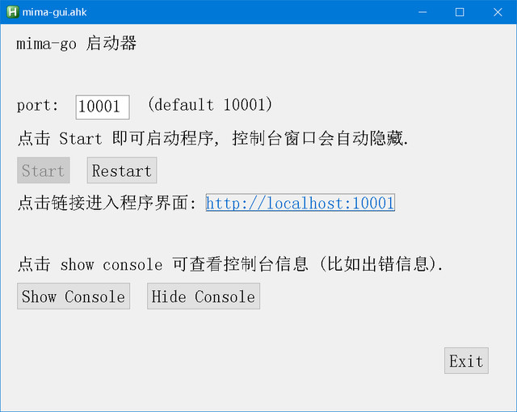
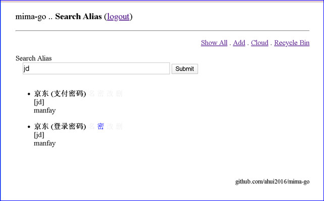

# mima-go
 mima-go is a password manager.
 
 - 这是一个桌面版的密码管理器.
 - 可备份至云端.
 - 采用 Go 语言制作, 支持 Windows, MacOS, Linux 等主流平台.
 - 独有的 Alias 功能 (详见后文)
 - 甚少密码管理软件具备的 "保留修改历史" 功能 (修改不用担心覆盖旧资料, 过去曾用过的密码全部保留)
 
## 不依赖任何数据库
 
- 因此, 不需要安装数据库, 也不需要编译 SQLite
- 由于最流行的 Go 语言 SQLite driver 是 go-sqlite3, 而它采用了 cgo, 编译需要 gcc, 
   因此如果采用 SQLite 作为数据库, 在编译上会稍稍麻烦一点 (尤其是在 Windows 系统里).
- 而本软件不使用数据库, 可完全发挥 Go 语言容易编译, 高速编译的特点.

## 安装方法

- 通过 git clone 或直接 zip 的方式获取本软件的全部源代码
- 安装 Go 语言开发环境后用 go build 命令编译即可生成可执行文件
  (Windows 用户也可直接使用我编译好的 mima-go.exe)
- 本程序的依赖非常少 (详见 go.mod), 因此编译过程应该非常顺利.

## 使用方法

- go build 生成可执行文件后, 通过命令行或 mima-gui 启动器启动程序, 然后通过网页访问.
- 虽然采用了网站形式, 但只是为了制作上的方便, 本质上不是网站, 不可放到公网, 只能本地使用.
- 命令行参数 -port, 可更改端口, 默认端口 10001 (因此默认网址是 http://localhost:10001).
- 命令行参数 -term, 可更改自动登出时间, 默认 30 分钟.
- 隐藏功能 (高级功能):
  - 更改主密码 http://localhost:10001/change-password
  - 删除本地备份文件 http://localhost:10001/delete-tarballs

## mima-gui 启动器

- 由于在 Windows 里运行本程序会显示传说中让人讨厌的黑色窗口, 而刚好在 Windows 里用 AutoHotkey
  做简单的 GUI 程序非常轻松, 因此我做了一个简单的启动器.
- 到 https://autohotkey.com 下载安装 AutoHotkey 后, 双击本程序源码中的 mima-gui.ahk 即可启动.

## 特色功能: Alias

- Alias功能, 即别名功能, 是本软件的一大特色.
- 本软件没有 **搜索**, **顶置(最爱)**, **第二密码**, **分组** 等功能, 但可以利用 Alias 功能来实现.
- 在 edit 页面, 可给每个条目设定一个 Alias(别名).
- 本软件的首页是一个搜索框, 输入任何条目的别名即可快速检索 (精确查找, 并且区分大小写).
- 别名允许重复, 因此, 多个条目共用同一个别名, 即可实现类似于一个条目有多个密码的效果, 或者实现类似于分组的效果.
- 这个有点奇特的 Alias 功能的设计思想是: 相信人脑, 而不是完全依赖电脑.
- 原理: 对一个事物命名, 并经常呼唤其名字, 符合人脑的习惯, (不需要刻意背诵)在使用过程中能自然产生很深刻的记忆,
  同时通过一次次输入别名, 也会产生肌肉记忆.
- 传统的顶置功能的弊端: 顶置条目数量会越来越多, 顶置效果会越来越差啊, 需要经常权衡取消哪些顶置,
  反而增加了思维负担.
- 建议取别名时, 用尽量短的, 非常容易输入的名字. 比如:
  - 京东的别名可以是 jd
  - 淘宝的别名可以是 tao
  - 支付宝的别名可以是 zhi 或 pay
  - 微信的别名可以是 v 或 vx 或 wx
  - 苹果账号的别名可以是 a 或者 i
- 你会发现, 使用别名, 会比传统的搜索, 顶置, 分组更好用.

### 使用示例

- 下图是我自己实际使用中的截图, 我把京东的登录密码与支付密码分别建立条目, 但采用相同的别名 jd,
这样, 当我输入 jd 按回车键, 就能精确地列出这两个条目.
- 如果使用传统的密码管理软件设计, 用户可能需要输入汉字 "京东", 这比输入 jd 麻烦, 而如果输入 jd,
  其他条目的标题, 用户名, 网址等等万一刚好包含这两个字符 (因为两个字符很短, 所以很可能发生这种情况)
  就都会出现在搜索结果里, 感觉不够干净利落.
- 点击每个标题后面的 "名" 字可复制用户名, 点击 "密" 字可复制密码, 并且 30 秒后会自动清空剪贴板.
  (但如果使用了剪贴板工具, 则无法彻底清空, 如果担心剪贴板的安全, 可点击 "改" 字查看密码.) 

## 云备份

- 选择 IBM COS 作为云端储存 (注意免费版有使用限制, 详见后文 "缺点" 中的内容)
- 只具有云备份功能, 没有云同步功能, 在设计上不支持多终端同步:
  - 平时只能单向从本地向云端上传数据
  - 只有未创建本地账号的状态 (本地不存在 ./mimadb/mima.db 文件时), 才能从云端下载数据, 
    并且, 这样恢复数据库后, 会在云端生成一个新的备份文件, 再次上传时不会覆盖原来的文件.
  - 说起来比较复杂, 用户只需要记住这句话就行: 只有单向备份功能, 没有双向同步功能.

### IBM Cloud Storage Service
- 优点:
  - 有免费额度, 不需要绑定信用卡, 国内能直接访问
  - 即使使用收费额度, 使用量不大时价格也很低 (不设最低消费)
    There is no minimum fee, so you pay only for what you use.
  - 符合 Amazon S3 标准, 后续可轻松转移平台
  - 有 Golang SDK
- 缺点:
  - 免费的上传次数太少
  - 闲置一个月会被删除数据? (未实测, 但应该会)
    (Lite plan services are deleted after 30 days of inactivity.)

## 关于安全

- 虽然采用了网站形式, 但只是为了制作上的方便, 本质上不是网站, 不可放到公网, 只能本地使用.
- 为了提高安全性, 本软件禁止了浏览器对本软件网页的缓存, 因此在使用过程中浏览器的"后退"
  键基本处于不可用的状态, 请尽量通过点击页面内的链接来使用本软件.
- 这个软件主要是为了我自己使用而开发, 采用可信赖且容易正确处理的加密算法 (golang.org/x/crypto/nacl/secretbox),
  每次向 mima.db 文件写入数据钱都自动生成备份文件, 可设定时间自动退出程序要求重新登入 (默认 30 分钟),
  保留修改历史, 云端备份功能...... 等等, 应该可以最大限度地确保数据安全.
- 更多关于安全的说明请看这里 https://github.com/ahui2016/PyMima/blob/master/README.md 
  (另一个密码管理器, 本软件的前身, 其中关于安全的说明仍适用于本软件.)
- 主密码的长度, 取决于你使用本软件来保存什么内容:
  - 如果你认为加密的内容非常重要, 请用 12 位以上, 包含大小写字母, 数字, 以及特殊字符(比如加减乘除等符号)
    的密码, 不可使用有意义的单词/拼音, 并且不可使用生日, 电话号码等个人信息.
    这样可以防止暴力破解, 但缺点是一旦忘记密码, 自己也无法破解.
  - 如果你担心忘记主密码, 并且认为加密的内容被破解也问题不大, 可考虑采用 8 位不包含个人信息的密码,
    或者在生日/电话号码后加上 8 位不包含个人信息的字符组成密码, 这样的密码是可以暴力破解的, 不安全,
    只要有信心不会忘记主密码, 就不建议使用这种密码.
- 千万不可让浏览器记住本软件的主密码!
  
## 免责声明

我只是把自己使用的软件的源代码公开, 我已尽自己的能力最大程度地确保本软件的安全性, 
用户可免费使用本软件, 但万一有什么泄密、造成直接或间接损失等, 我一概不负责任。
（使用别的任何密码管理软件, 即使是收费的, 他们也一样不会负责用户的损失.）
